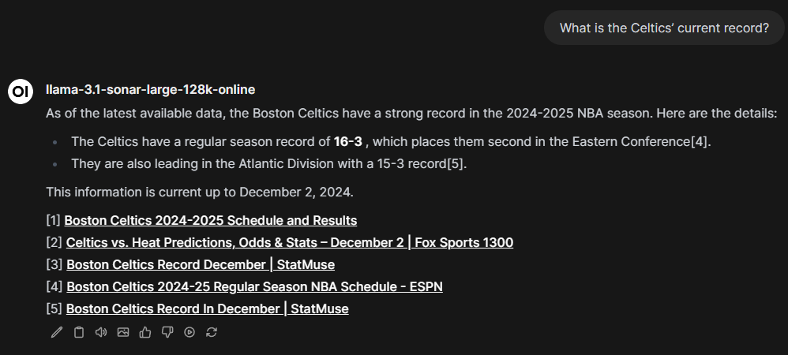

## Installation

Install these pipes by navigating to Admin Settings > Functions, creating a new function, and pasting the contents of the file.

## Provider Progress

| name        | openai-compatible | manifold progress |
| ---         | ---               | ---   |
| anthropic   | no                | &#9744; |
| aws bedrock | no                | &#9744; |
| codestral   | no                | &#9744; |
| cohere      | no                | &#9744; |
| deepinfra   | yes               | &#9744; |
| deepseek    | yes               | &#9744; |
| gemini      | no                | &#9744; |
| litellm     | yes               | :white_check_mark: |
| mistral     | no                | &#9744; |
| ollama      | yes(?)            | &#9744; |
| perplexity  | no                | :white_check_mark: |
| togetherai  | yes               | &#9744; |
| vertex      | no                | &#9744; |
| voyage      | no                | &#9744; |

## Pipes

### litellm.py

This pipe makes standard aiohttp calls to an existing LiteLLM endpoint. See the list of supported providers [here](https://docs.litellm.ai/docs/providers).

Currently the pipe also supports including citations in the output from the following providers:

* Perplexity

#### Configuration

* **Valves**
    * **LiteLLM Base Url**: This is the url of your LiteLLM endpoint. If you're running Open-WebUI on the same host/cluster as your LiteLLM container, this is usually the internal service name (e.g. `http://litellm:4000` for docker, `http://litellm.litellm:4000` for kubernetes).
    * **LiteLLM API Key**: This is your LiteLLM master API key.
    * **LiteLLM Pipeline Debug**: Enable debug logging in the Open-WebUI logs for this pipe.
    * **Extra Metadata**: A dictionary of extra metadata to be applied to the calls to LiteLLM.
    * **Extra Tags**: A list of tags to be applied to the calls to LiteLLM.
    * **Youtube Cookies Filepath**: This is a path _somewhere within the container_ to a text file containing youtube cookies. This is used by yt_dlp to get the title of a youtube video if one is included in any citations.
    * **Perplexity Return Citations**: This enables citation retrieval in calls to Perplexity models.

#### YT-DLP Cookies

See the following readmes for guides to extracting YouTube cookies in a way that they can be used by yt_dlp. Simply paste the contents into a file called e.g. `cookies.txt`, place it somewhere (via volume mount, configmap, etc.) in your container, and put the _full path_ to the file into the `Youtube Cookies Filepath` valve.

* [Exporting YouTube Cookies](https://github.com/yt-dlp/yt-dlp/wiki/Extractors#exporting-youtube-cookies)
* [How do I pass cookies to yt-dlp?](https://github.com/yt-dlp/yt-dlp/wiki/FAQ#how-do-i-pass-cookies-to-yt-dlp)

#### Citations Example

Citations included from Perplexity models are included in the response in a `citations` key. As the `citations` emitter appears to be either a work in progress or deprecated (and is in either case undocumented at the time of this writing), I've included the citations underneath the response. An example output looks like the following:

